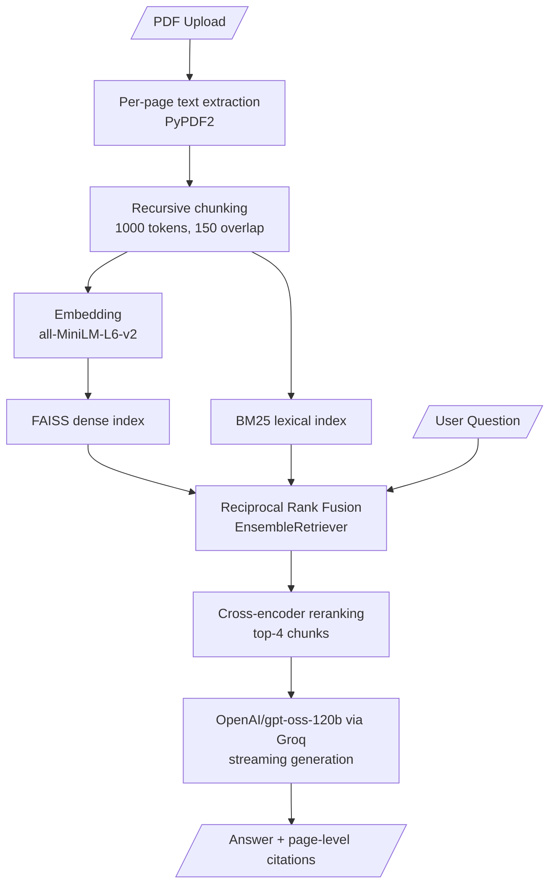

# Scribe — Chat with Your PDFs

> Upload any PDF. Ask anything. Get instant, cited answers — powered by Groq's `openai/gpt-oss-120b` and hybrid retrieval.

<br>

## What it does
 
Scribe is a production-grade RAG (Retrieval-Augmented Generation) application that lets you have a real conversation with your documents. Upload one or more PDFs, and Scribe will:
 
- **Auto-summarise** every document the moment it's uploaded
- **Answer questions** grounded strictly in your document content — no hallucinations
- **Retrieve with hybrid search** — combining exact keyword matching (BM25) and semantic search (FAISS), then reranking with a cross-encoder for precision
- **Cite every answer** with the exact source file and page number
- **Stream responses** token-by-token like a real chat interface
- **Export your conversation** as a formatted Markdown file

<br>

## Features
 
| Feature | Details |
|---|---|
| ⚡ Fast inference | Groq's LPU delivers `openai/gpt-oss-120b` responses in ~2s |
| 🔍 Hybrid retrieval | BM25 (lexical) + FAISS (semantic) fused via Reciprocal Rank Fusion — catches exact terms and numbers that pure embedding search often misses |
| 🎯 Cross-encoder reranking | Top candidates from hybrid retrieval are rescored with a cross-encoder for higher precision before generation |
| 📋 Auto-summary | Each uploaded PDF is summarised in 3–4 sentences before you ask anything |
| 📄 Page citations | Every answer shows `filename · page N` chips so you know exactly where the answer came from |
| 💬 Multi-turn memory | Conversation context is preserved across turns via `ConversationBufferMemory` |
| ⬇️ Chat export | Download the full conversation with sources as a `.md` file |
| 🎨 Polished UI | Custom dark theme with DM Sans, streaming cursor, document cards, and status indicators |
<br>

## Tech Stack
 
| Layer | Technology |
|---|---|
| LLM | Groq · `openai/gpt-oss-120b` |
| Embeddings | `sentence-transformers/all-MiniLM-L6-v2` via HuggingFace |
| Lexical Retrieval | `BM25Retriever` (rank_bm25) |
| Vector Store | FAISS (in-memory, CPU) |
| Retrieval Fusion | `EnsembleRetriever` (Reciprocal Rank Fusion) |
| Reranking | `CrossEncoderReranker` — `cross-encoder/ms-marco-MiniLM-L-6-v2` |
| RAG Framework | LangChain  `ConversationalRetrievalChain` |
| PDF Parsing | PyPDF2 with per-page metadata extraction |
| Frontend | Streamlit with custom CSS |
| Memory | `ConversationBufferMemory` |
<br>

## Architecture
 


<br>
 
## Getting Started
 
### 1. Clone the repo
 
```bash
git clone https://github.com/Sanya003/Scribe
cd Scribe
```
 
### 2. Install dependencies
 
```bash
pip install -r requirements.txt
```
 
### 3. Set up environment variables
 
Create a `.env` file in the root directory:
 
```env
GROQ_API_KEY=your_groq_api_key_here
```
 
### 4. Run the app
 
```bash
streamlit run app.py
```

<br>

## Usage
 
1. Upload one or more PDF files using the sidebar
2. Click **⚡ Analyse Documents** — Scribe will index and summarise your files
3. Ask any question in the chat input
4. Answers stream in real time with page-level source citations
5. Click **⬇️ Export Chat** to download your conversation
 
<br>
 
## Project Structure
 
```
Scribe/
├── app.py              # Main Streamlit app
├── requirements.txt    # Dependencies
├── .env                # API keys
└── README.md
```
<br>
